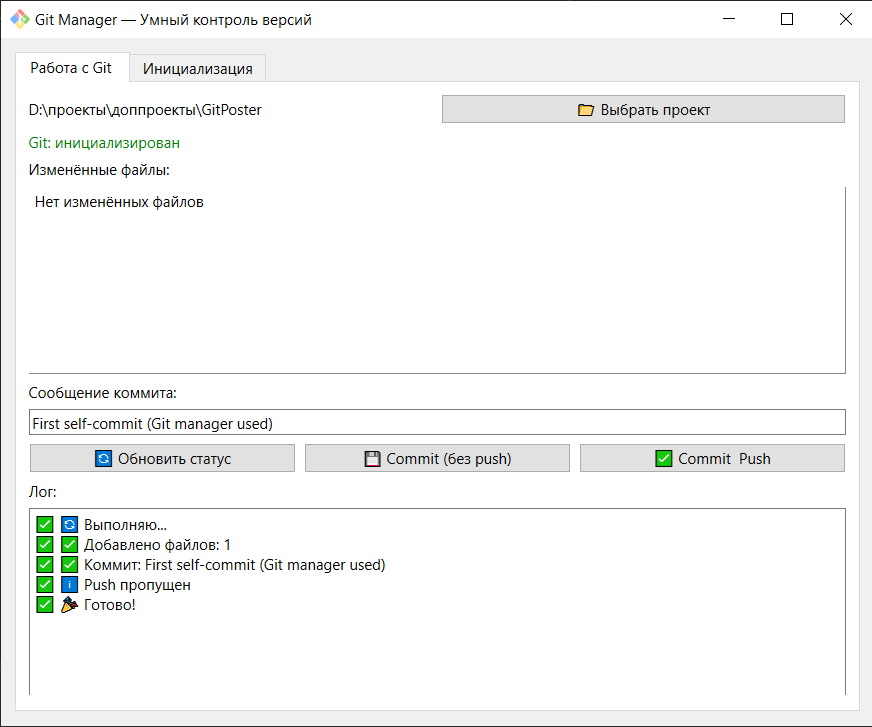

# GitPoster — GUI для управления Git (для смертных)

**GitPoster** — это десктопное приложение, которое делает работу с Git простой и безопасной.  
Не нужно помнить команды.  
Не нужно бояться сломать репозиторий.  
Просто выбери, что сделать — и нажми кнопку.

👉 Для новичков, промышленных инженеров, тех, кто устал от терминала.

---

## 📦 Что умеет

### ✅ Основное
- [x] **Выбор папки проекта**
- [x] **Автоматическое определение: инициализирован ли Git**
- [x] **Просмотр изменённых файлов** (M, A, D, ??)
- [x] **Выбор файлов для коммита** (как в TortoiseGit)
- [x] **Ввод сообщения коммита**
- [x] **Commit & Push одной кнопкой**
- [x] **Commit без push**
- [x] **Лог всех действий** (что сделано, где ошибка)

### ✅ Инициализация (для новых проектов)
- [x] **Создание `.gitignore`** (автоматически, с шаблоном для Python)
- [x] **Настройка `user.name` и `user.email`**
- [x] **`git init + add + commit`** — одной кнопкой

### ✅ Безопасность
- Не перезаписывает существующий `.git`
- Не делает `push`, если не выбрал
- Показывает ошибки в понятном виде

---

## 🖼️ Скриншот интерфейса


---

## 🚀 Как запустить

### Вариант 1: Запустить `.exe` (для пользователей)
1. Скачай `GitPoster.exe` из релизов
2. Запусти — работает без установки Python

### Вариант 2: Запустить из исходников (для разработчиков)
```bash
git clone https://github.com/ТВОЙ_ЮЗЕР/GitPoster.git
cd GitPoster
python -m venv .venv
.venv\Scripts\activate
pip install -r requirements.txt
python gui/git_manager.py